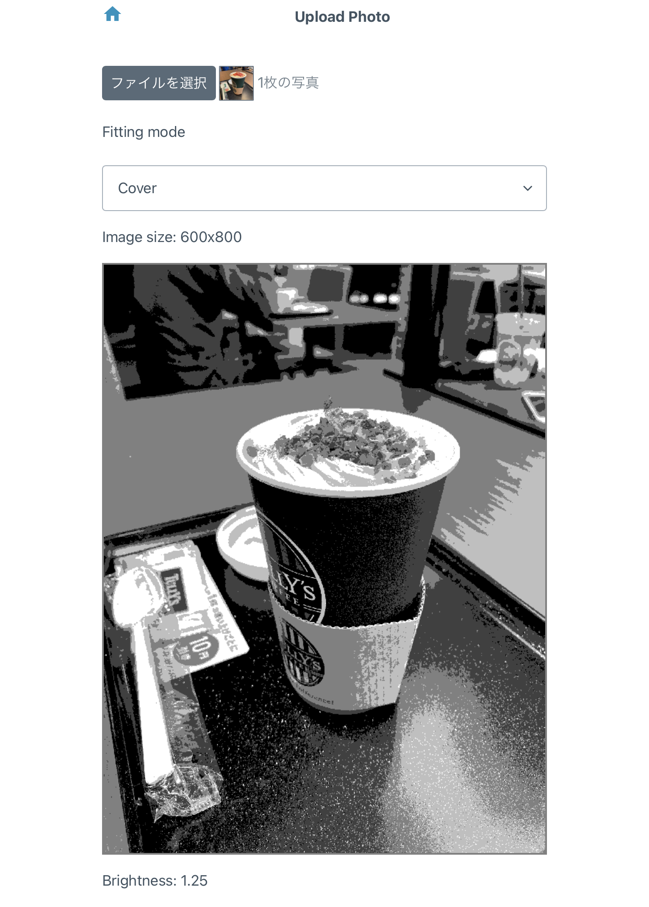
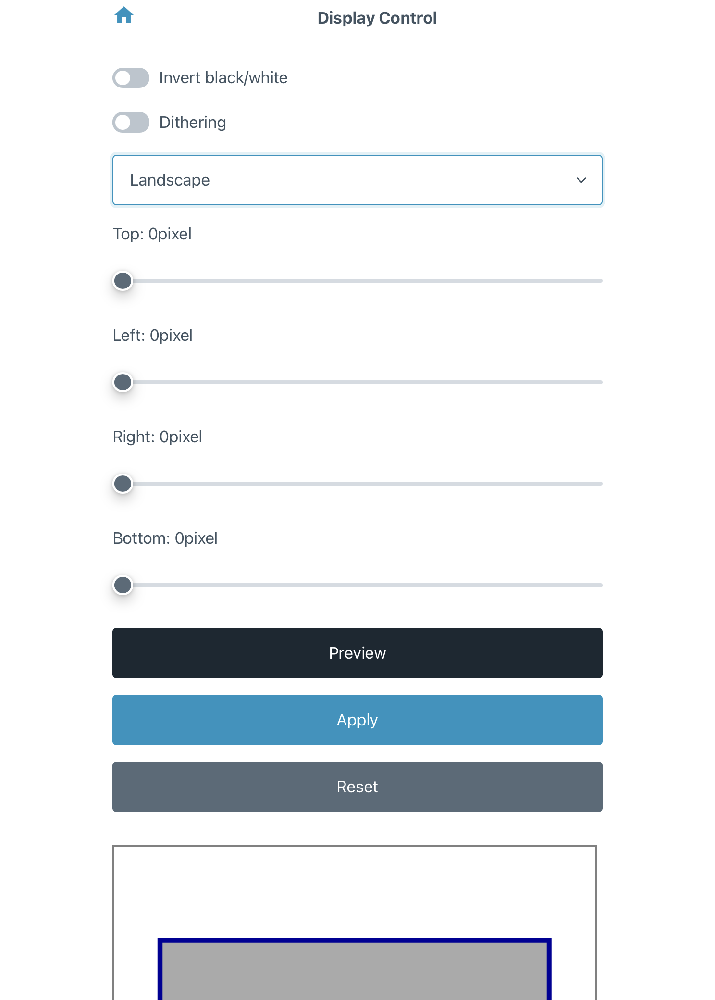
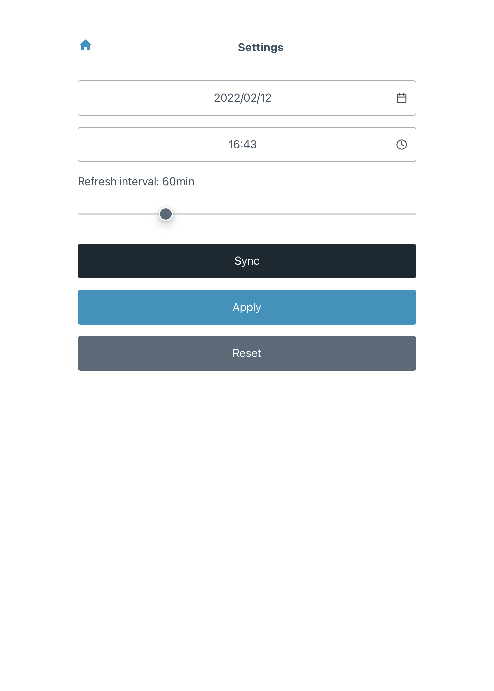

# InkArt

Display grayscale art on Inkplate!


_Works with Inkplate 6 and Inkplate 10._

|                 Inkplate 6                 |                 Inkplate 10                  |
| :----------------------------------------: | :------------------------------------------: |
|  |  |

### WebApp

|          Home          |           Upload           |      File Manager      |
| :--------------------: | :------------------------: | :--------------------: |
|  |  |  |

|           Display            |            Settings            |      Information       |
| :--------------------------: | :----------------------------: | :--------------------: |
|  |  |  |

## Hardware requirement

- [Inkplate 6](https://www.crowdsupply.com/e-radionica/inkplate-6) or [Inkplate 10](https://www.crowdsupply.com/e-radionica/inkplate-10)
- microSD card
- LiPo battery

## Build firmware and web app

### Firmware

[PlatformIO](https://platformio.org/) is used for firmware development.
To build it, install PlatformIO and run the following command.

#### Inkplate 6

```sh
cd firmware
pio run -e inkplate-6
```

#### Inkplate 10

```sh
cd firmware
pio run -e inkplate-10
```

### Web App

[node.js](https://nodejs.org/) is used for web app development.
To build it, install node.js and run the following command.

```
cd web-app
npm install
npm run build
```

The build artifacts are output to **web-app/dist**

## Setup

First, burn web-app to Inkplate. Connect Inkplate to your PC and run the following command.

- Inkplate 6: `pio run -e inkplate-6 -t uploadfs`
- Inkplate 10: `pio run -e inkplate-10 -t uploadfs`

Next, burn the built firmware to Inkplate.

- Inkplate 6: `pio run -e inkplate-6 -t upload`
- Inkplate 10: `pio run -e inkplate-10 -t upload`

If you have any questions or need more information about build/burn firmware with PlatformIO, please search it with [DuckDuckGo](https://duckduckgo.com/) yourself.

## How to use

1. Power on an Inkplate. Inkplate boots up to setup mode and launches the access point.
2. Connect to the access point shown on the Inkplate and access the web app.
3. Configure settings of device orientation, display area and update interval if you need.
4. Upload the image you want to display.
5. Touch all the touchpads on Inkplate or restart from web app.
6. Wait a few seconds until an image is displayed. After that Inkplate goes into deep sleep soon.
7. Inkplate will wake up and refresh the image after the update interval elapses.

## How to start development

Open [InkArt.code-workspace](InkArt.code-workspace) with [VS Code](https://code.visualstudio.com/).

## License

Licensed under [MIT license](LICENSE).
